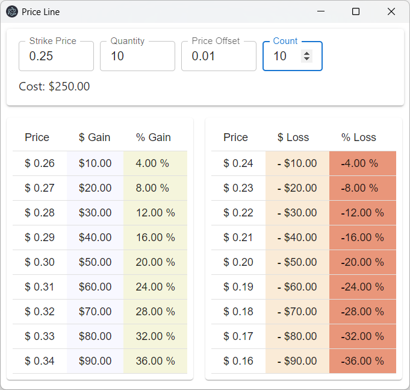

# Price Line

Display potential gain/loss for an option strike price.

This displays the potential gain/loss in dollar and percentage for a stock option strike price vs the potential price, giving you a quick an overall situational awareness of how your option is doing.
You **should** have a proper stop-loss and take-profit.

- **Strike Price** - The option strike price.
- **Quantity** - The number of options bought. _Remember, each option is 100 shares._
- **Price Offset** - The dollar amount to offset from the strike price per count.
- **Count** - The number of amount to show.

## Available Scripts

In the project directory, you can run:

### `npm start`

Runs the app in the development mode.\
Open [http://localhost:3000](http://localhost:3000) to view it in your browser.

The page will reload when you make changes.\
You may also see any lint errors in the console.

### `npm run electron`

Runs the app in an electron browser.

### `npm run build`

Builds the app for production to the `build` folder.\
It correctly bundles React in production mode and optimizes the build for the best performance.

The build is minified and the filenames include the hashes.\
Your app is ready to be deployed!

See the section about [deployment](https://facebook.github.io/create-react-app/docs/deployment) for more information.

